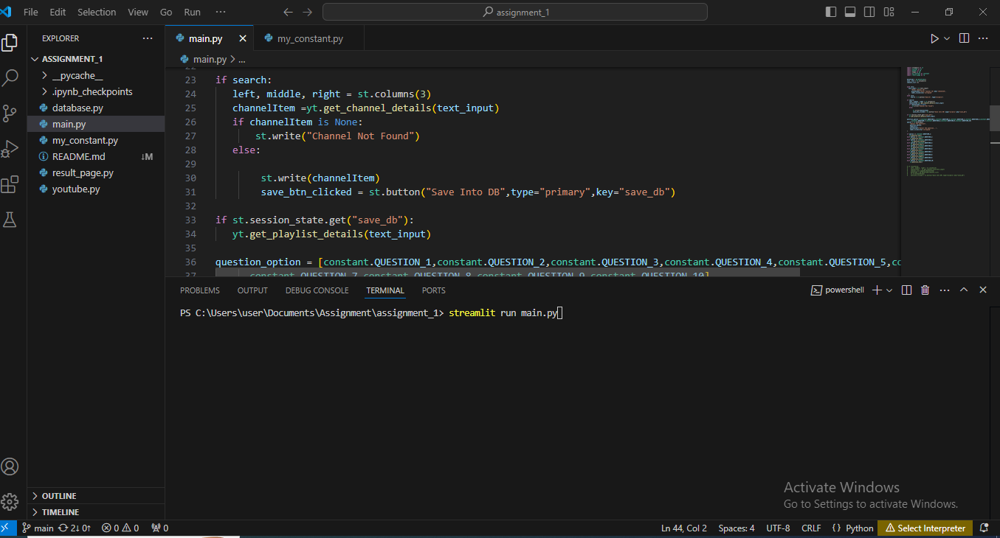
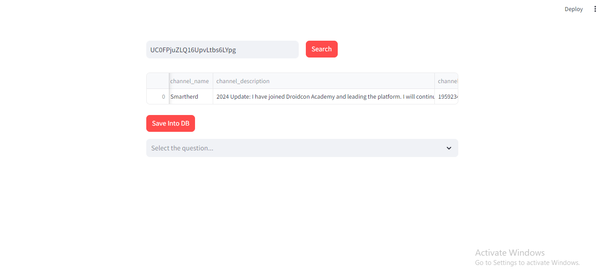
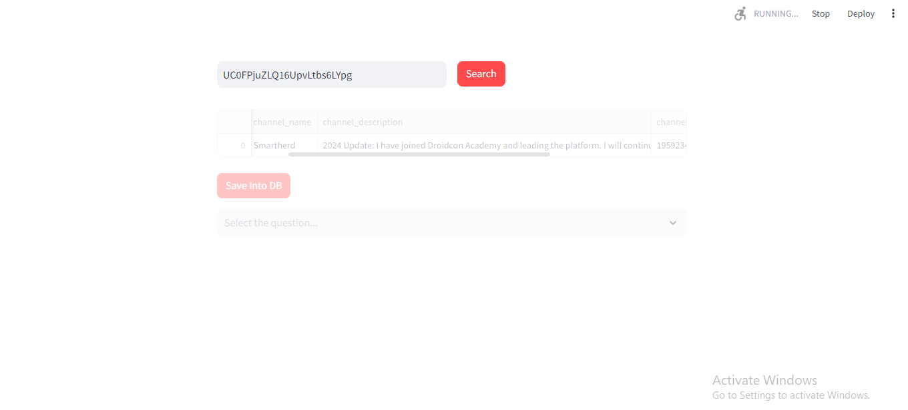
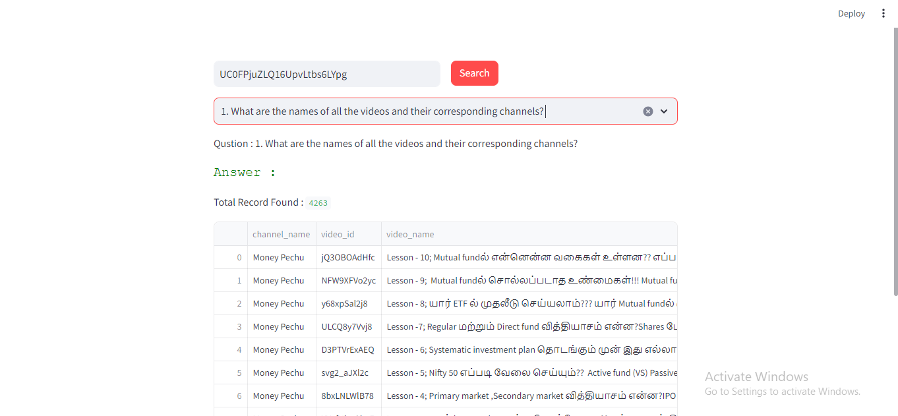

# Assignment_1
YouTube Data Harvesting and Warehousing using SQL and Streamlit

## Setup Environment
1. Install the streamlit locally
   
   ```bash
   pip install streamlit
   streamlit hello
   ```
   
   To more about refer this link [Streamlit Document](https://docs.streamlit.io/)

2. Install the visual studio
   
   Install the visual studio to create a python files.
   
   Refer the link to install the [Visual Studio](https://code.visualstudio.com/download)

3. Create Youtube API Key

    Refer the link to create and access the youtube [YouTue](https://developers.google.com/youtube/v3/getting-started)

4. Install the mysql workbench

   Download the link from [here](https://dev.mysql.com/downloads/workbench/) and install it.

## Step to run the application
1. Add Youtube channel Developer API key in my_constant.py file.
2. Open the visual studio terminal use this comment to run application
   ```bash
   streamlit main.py
   ```
 3. After run in the terminal application open inside the broswer.
 4. Enter some youtube channel id search field.
 5. Once hit the "Search" button you will get the youtube channel details.
 6. If you hit the 'Save Into DB' button, the YouTube channel details, playlist details, and video details will be stored inside the MySQL table.
 7. After the data is inserted, you can select the dropdown to see the list of questions. Once you select a question, the corresponding answer will be displayed.

Fig 1:


Fig 2:


Fig 3:


Fig 4:



   
     
